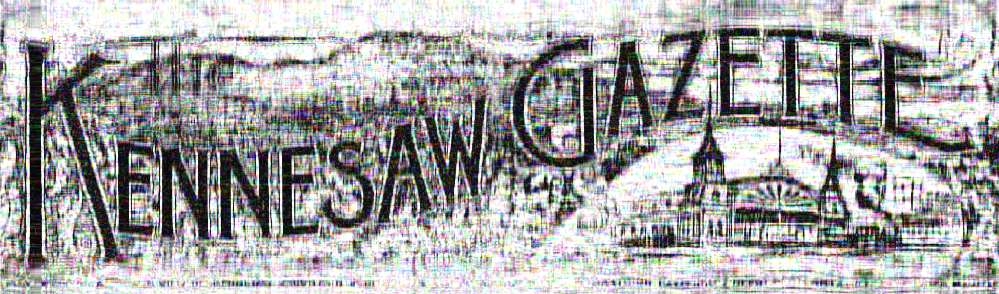
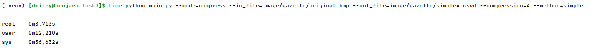
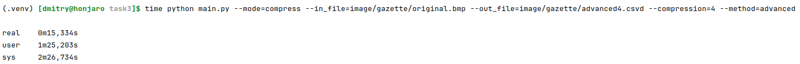
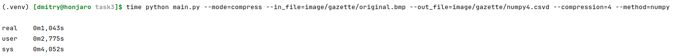

# Задание 3

## Формат .csvd

В файле этого формата хранится сингулярное разложение для BMP изображения.

$A = U \Sigma V^*$, где $U$ - матрица $m \times k$, $\sigma$ диагональная матрица $k \times k$, с сингулярными числами
на главной диагонали, $V^*$ - матрица размера $k \times n$

- 4 байта: формат файла - `СSVD`.
- 4 байта: значение $m$.
- 4 байта: значение $k$.
- 4 байта: значение $n$.
- $k*4(m+n+1)$ байт: для каждого канала цвета `R`, потом `B`, потом `G` представление его сингулярного
  разложения - матрица $`U`$, диагональ матрицы $`S`$, матрица $`V^*`$ (хранятся в `float32`).

## Реализация

Была реализована программа с CLI способная сжимать и распаковывать BMP изображения в формат CSVD на основе сингулярного
разложения. Были использованы следующие алгоритмы:

- svd из numpy
- power method
- block power method

## Эксперимент 1

# Исходное изображение

Сжатие проводилось с параметром `compression=4`

# Результаты

| Simple                         | Advanced                         | Numpy                         |
|--------------------------------|----------------------------------|-------------------------------|
|  |  |  |
|     |     |     |

На изображении при сжатии степенным методом появились цветные пятна, хотя оригинал черно-белый. А результаты advanced и
numpy методов получились более чёткими и не появилось других цветов, но между собой почти не отличаются.
По времени работы numpy оказался самым быстрым, за ним метод simple, и самым медленным оказался advanced.

## Эксперимент 2

# Исходное изображение

Сжатие проводилось с параметром `compression=2`

# Результаты

| Simple                         | Advanced                         | Numpy                         |
|--------------------------------|----------------------------------|-------------------------------|
|  |  |  |

Общая картина напоминает результат эксперимента 1. Advanced и numpy методы не показали сильного отличия в качестве. В
обоих случаях у линий появился "ореол", появилась тусклая синяя линия, линии стали более мутными. А у степенного метода
опять наблюдалось появление цветных пятен на черном фоне, но не наблюдается такого чёткого ореола вокруг линий, сами же
линии более "прерывистые", больше различных артефактов. По времени работы разница сильная, самый быстрый numpy, за ним
simple, а за ним advanced. simple и advanced работали очень долго, advanced точно более 5 минут, настолько долго, что
запустив первый раз без замера времени, запускать повторно с таймером не хватило сил:(

## Вывод

Numpy и advanced показывали очень схожие результаты по качеству, но разница по времени была очень велика. Степенной
метод работал быстрее чем advanced, но проигрывал по качеству и к тому же он все равно медленнее numpy по времени.
Поэтому из предложенных методов, разложение реализованное в библиотеке numpy - фаворит.