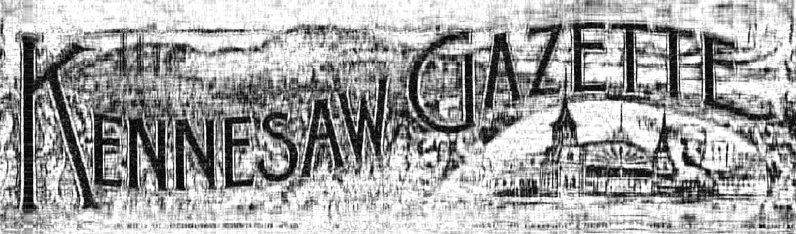

# Задание 3

## Формат .csvd

В файле этого формата хранится сингулярное разложение для BMP изображения.

$A = U \Sigma V^*$, где $U$ - матрица $m \times k$, $\sigma$ диагональная матрица $k \times k$, с сингулярными числами
на главной диагонали, $V^*$ - матрица размера $k \times n$

- 4 байта: формат файла - `СSVD`.
- 4 байта: значение $m$.
- 4 байта: значение $k$.
- 4 байта: значение $n$.
- $k*4(m+n+1)$ байт: для каждого канала цвета `R`, потом `B`, потом `G` представление его сингулярного
  разложения - матрица $`U`$, диагональ матрицы $`S`$, матрица $`V^*`$ (хранятся в `float32`).

## Реализация

Была реализована программа с CLI способная сжимать и распаковывать BMP изображения в формат CSVD на основе сингулярного
разложения. Были использованы следующие алгоритмы:

- svd из numpy
- power method
- block power method

## Эксперимент 1

# Исходное изображение

Сжатие проводилось с параметром 'compression=4'

# Результаты

| Simple                         | Advanced                         | Numpy                         |
|--------------------------------|----------------------------------|-------------------------------|
|  |  |  |